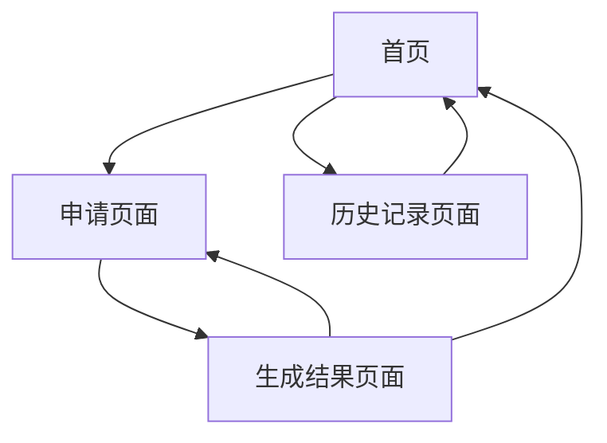

# 2025长安菊展车辆通行证自助生成系统-产品需求文档

## 1. 产品概述

本产品是一个专为2025长安菊展设计的车辆通行证自助生成系统，用户无需注册登录即可在线申请并生成个人专属的车辆通行证。
- 解决菊展期间车辆通行证申请繁琐、效率低下的问题，为参展人员和工作人员提供便捷的自助服务。
- 通过数字化手段提升菊展活动的组织效率和用户体验。

## 2. 核心功能

### 2.1 用户角色
本系统无需用户注册登录，所有访问者均为匿名用户，享有相同的功能权限。

### 2.2 功能模块

本系统包含以下核心页面：
1. **首页**：系统介绍、申请入口、历史记录查看
2. **申请页面**：信息填写表单、实时预览
3. **生成结果页面**：通行证展示、下载功能、分享链接
4. **历史记录页面**：本地申请记录管理

### 2.3 页面详情

| 页面名称 | 模块名称 | 功能描述 |
|----------|----------|----------|
| 首页 | 系统介绍 | 展示菊展活动信息、通行证申请说明和使用指南 |
| 首页 | 快速申请入口 | 提供醒目的申请按钮，引导用户进入申请流程 |
| 首页 | 历史记录入口 | 查看本地存储的申请记录和生成的通行证 |
| 申请页面 | 信息填写表单 | 输入申请人姓名、申请部门、邀请人员、车牌号等必要信息 |
| 申请页面 | 表单验证 | 实时验证输入信息的格式和完整性，提供错误提示 |
| 申请页面 | 实时预览 | 根据填写信息实时生成通行证预览图 |
| 生成结果页面 | 通行证展示 | 显示最终生成的手机版通行证图片 |
| 生成结果页面 | 下载功能 | 支持将通行证图片下载到本地设备 |
| 生成结果页面 | 分享链接生成 | 生成可分享的图片链接，方便用户传播 |
| 生成结果页面 | 重新申请 | 提供返回申请页面的快捷入口 |
| 历史记录页面 | 记录列表 | 展示所有本地存储的申请记录 |
| 历史记录页面 | 记录管理 | 支持查看、删除历史申请记录 |

## 3. 核心流程

用户访问系统首页 → 点击申请入口进入申请页面 → 填写申请人、申请部门、邀请人员、车牌号等信息 → 系统实时生成通行证预览 → 确认信息无误后提交申请 → 跳转到生成结果页面 → 查看最终通行证并可选择下载或获取分享链接 → 申请记录自动保存到本地存储。

用户也可以通过首页的历史记录入口查看之前的申请记录。

## 4. 用户界面设计

### 4.1 设计风格

- **主色调**：橙黄色系（#FF8C00）呼应菊花主题，辅助色为深蓝色（#1E3A8A）
- **按钮样式**：圆角矩形按钮，具有轻微阴影效果，支持悬停和点击状态
- **字体**：中文使用苹方或微软雅黑，英文使用Roboto，主标题18px，正文14px
- **布局风格**：卡片式设计，顶部导航栏，内容区域居中对齐
- **图标风格**：使用线性图标，配合菊花、车辆等主题元素

### 4.2 页面设计概览

| 页面名称 | 模块名称 | UI元素 |
|----------|----------|--------|
| 首页 | 系统介绍 | 橙黄色渐变背景，菊花装饰图案，大标题使用18px粗体字，卡片式信息展示 |
| 首页 | 快速申请入口 | 大尺寸橙色按钮，圆角8px，白色文字，悬停时加深颜色 |
| 申请页面 | 信息填写表单 | 白色背景卡片，输入框带有淡蓝色边框，标签使用14px字体，必填项标红星 |
| 申请页面 | 实时预览 | 右侧固定预览区域，显示通行证模板，动态更新用户输入内容 |
| 生成结果页面 | 通行证展示 | 居中显示生成的通行证图片，带有轻微阴影效果 |
| 生成结果页面 | 操作按钮 | 下载和分享按钮并排显示，使用不同颜色区分功能 |
| 历史记录页面 | 记录列表 | 列表式布局，每条记录显示申请时间、车牌号和操作按钮 |

### 4.3 响应式设计

本产品采用移动优先的响应式设计，主要针对手机端用户体验进行优化，同时兼容桌面端访问。支持触摸操作，按钮和链接区域足够大以便手指点击。