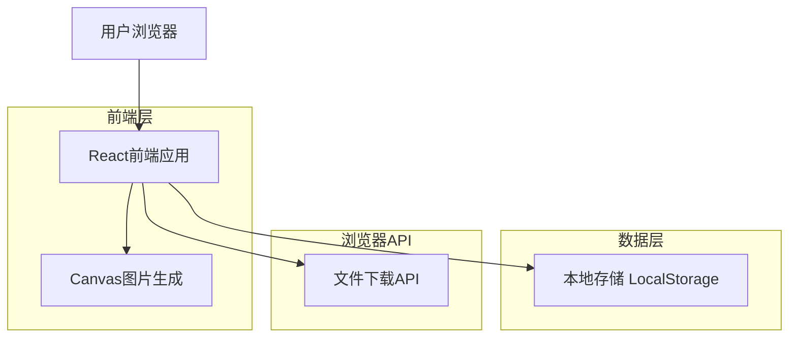
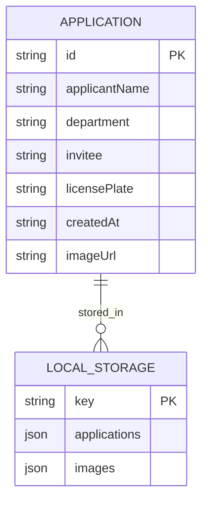

# 2025长安菊展车辆通行证自助生成系统-技术架构文档

## 1. 架构设计



## 2. 技术描述

- 前端：React@18 + TypeScript@5 + Vite@5 + TailwindCSS@3
- 状态管理：React Context + useReducer
- 图片处理：HTML5 Canvas API + Fabric.js
- 数据存储：浏览器 LocalStorage
- 响应式设计：TailwindCSS响应式工具类

## 3. 路由定义

| 路由 | 用途 |
|------|------|
| / | 首页，展示系统介绍和申请入口 |
| /apply | 申请页面，填写申请信息和实时预览 |
| /result/:id | 生成结果页面，显示通行证和下载功能 |
| /history | 历史记录页面，查看本地申请记录 |
| /share/:id | 分享页面，通过链接查看生成的通行证 |

## 4. 核心功能实现

### 4.1 数据类型定义

```typescript
// 申请信息接口
interface ApplicationData {
  id: string;
  applicantName: string;        // 申请人
  department: string;           // 申请部门
  invitee: string;             // 邀请人员
  licensePlate: string;        // 车牌号
  createdAt: string;           // 申请时间
  imageUrl?: string;           // 生成的图片URL
}

// 本地存储数据结构
interface LocalStorageData {
  applications: ApplicationData[];
  images: { [key: string]: string }; // base64图片数据
}
```

### 4.2 核心API功能

**图片生成功能**
```typescript
// 生成通行证图片
function generatePermitImage(data: ApplicationData): Promise<string>
```

**本地存储管理**
```typescript
// 保存申请记录
function saveApplication(data: ApplicationData): void

// 获取申请记录
function getApplications(): ApplicationData[]

// 删除申请记录
function deleteApplication(id: string): void
```

**文件下载功能**
```typescript
// 下载图片到本地
function downloadImage(imageUrl: string, filename: string): void
```

## 5. 数据模型

### 5.1 数据模型定义



### 5.2 本地存储结构

**LocalStorage键值对**
```javascript
// 存储申请记录
key: 'vehicle_permit_applications'
value: {
  "applications": [
    {
      "id": "uuid-string",
      "applicantName": "张三",
      "department": "市政府办公室",
      "invitee": "李四",
      "licensePlate": "浙F12345",
      "createdAt": "2024-12-19T10:30:00.000Z",
      "imageUrl": "permit_uuid-string"
    }
  ],
  "images": {
    "permit_uuid-string": "data:image/png;base64,iVBORw0KGgoAAAANSUhEUgAA..."
  }
}
```

**图片生成流程**
1. 加载通行证模板图片（车辆通行证_画板 1.jpg）
2. 使用Canvas API在模板上绘制用户输入的车牌号
3. 将Canvas内容转换为base64格式
4. 存储到LocalStorage并生成唯一ID
5. 提供下载和分享功能

**分享链接机制**
- 生成格式：`/share/{applicationId}`
- 通过URL参数传递申请ID
- 从LocalStorage读取对应的图片数据进行展示
- 支持直接访问和二维码分享